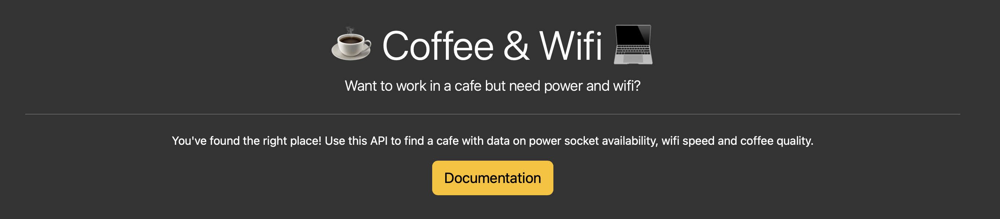

<div align="center" id="top"> 
  

  &#xa0;

  <!-- <a href="https://wifi_cafe.netlify.app">Demo</a> -->
</div>

<h1 align="center">Cafe and wifi</h1>

<p align="center">
  

  

  

  

  

  

  
</p>

<!-- Status -->

<!-- <h4 align="center"> 
	🚧  Wifi_cafe 🚀 Under construction...  🚧
</h4> 

<hr> -->

<p align="center">
  <a href="#dart-about">About</a> &#xa0; | &#xa0; 
  <a href="#sparkles-features">Features</a> &#xa0; | &#xa0;
  <a href="#rocket-technologies">Technologies</a> &#xa0; | &#xa0;
  <a href="#white_check_mark-requirements">Requirements</a> &#xa0; | &#xa0;
  <a href="#checkered_flag-starting">Starting</a> &#xa0; | &#xa0;
  <a href="#memo-license">License</a> &#xa0; | &#xa0;
  <a href="https://github.com/antoniorodr" target="_blank">Author</a>
</p>

<br>

## :dart: About ##

Flask-based API that provides a simple interface for managing a database of cafes. It allows users to perform various operations, including retrieving details about all cafes, getting a random cafe suggestion, searching for cafes by location, adding new cafes and updating specific cafe information.

## :sparkles: Features ##

:heavy_check_mark: Feature 1;\
:heavy_check_mark: Feature 2;\
:heavy_check_mark: Feature 3;

## :rocket: Technologies ##

The following tools were used in this project:

- [Flask SQLAlchemy](https://flask-sqlalchemy.readthedocs.io/en/stable/)
- [Flask Bootstrap](https://pythonhosted.org/Flask-Bootstrap/)

## :white_check_mark: Requirements ##

Before starting :checkered_flag:, you need to have - [Flask SQLAlchemy](https://flask-sqlalchemy.readthedocs.io/en/stable/) and - [Flask Bootstrap](https://pythonhosted.org/Flask-Bootstrap/) installed. Use the requirements.txt.

## :checkered_flag: Starting ##

```bash
# Clone this project
$ git clone https://github.com/antoniorodr/wifi_cafe

# Access
$ cd wifi_cafe

# Install dependencies
$ yarn

# Run the project
$ yarn start

# The server will initialize in the <http://localhost:3000>
```

## :memo: License ##

This project is under license from MIT. For more details, see the [LICENSE](LICENSE.md) file.


Made with :heart: by <a href="https://github.com/antoniorodr" target="_blank">Antonio Rodriguez</a>

&#xa0;

<a href="#top">Back to top</a>
